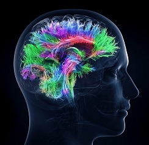

# Babar Knowledge System

Babar is an independent research project in the field of Artificial Intelligence.

One of the goals of this project is to leverage both neural and symbolic AI rather than perceive them at odds with each other. In this context several approaches are explored which can be seen as leveraging model-based AI (reductionism) as a bootstrapping mechanism for model-free AI (holism).

The Babar knowledge system is named in homage to John McCarthy who not only invented the LISP programming language but also coined the term “Artificial Intelligence” in 1958.

Babar is implemented in several programming languages including CLOS, Python and Clojure.
THe Clojure module, Clobar, implements the user interface and web development aspects.
The Python module, Pybar, is used for web scraping and crawling as well as for the Deep Learning aspects of the system. Finally the CLOS module, Lispbar, is used to implement the symbolic AI elements of the project.

# Installation

[Setup instructions](doc/setup.md)

# Clobar

HTML Generation  
Clojure Libraries  
Javascript Libraries  

# Pybar

Crawling and scraping
Data sources
sNeural Networks  
LSTM based Classifiers

# Lispbar  

[Startup instructions](doc/lispbar.md)

### The English Language Parser

[Parser Documentation](doc/parser.md)

Learning Grammar Productions
Knowledge Extraction
Clausal Form Logic
Semantic Nets
Clustering Wikipedia Topics
Inductive Logic Programming

## Postgres

[Wikipedia Graph](doc/db.md)

## Applications  

Browsing Wikipedia  
Classifying Google Search Results  

## User Interface Examples

[Screenshots](doc/screenshots.md)
